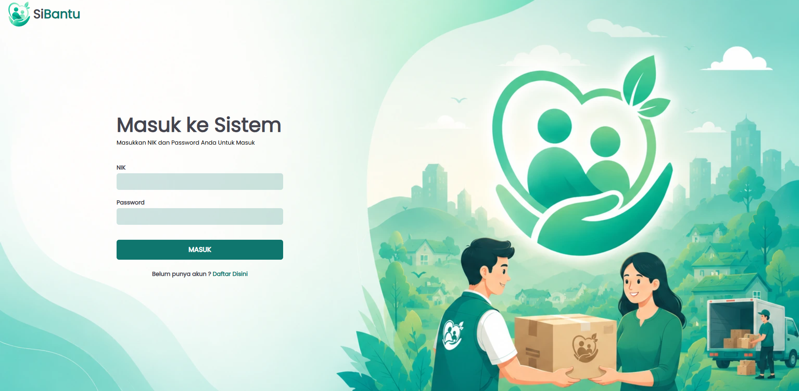
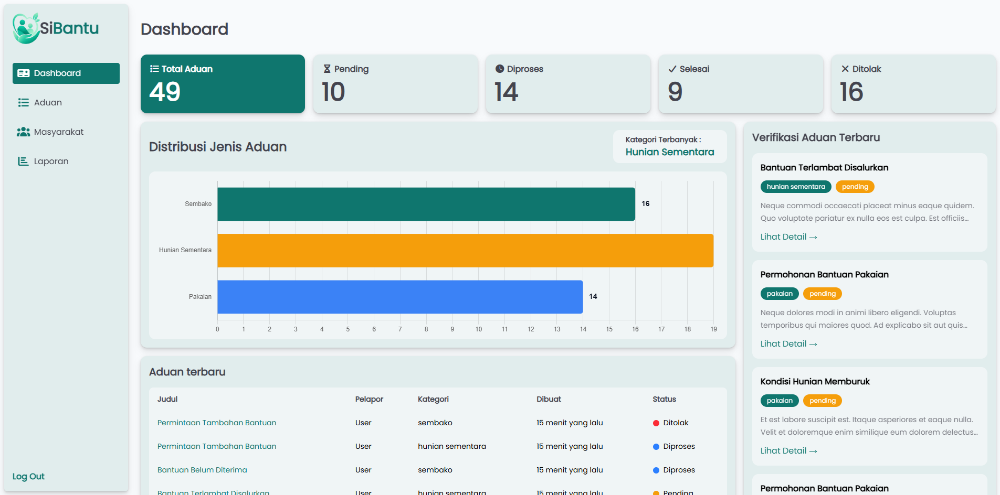
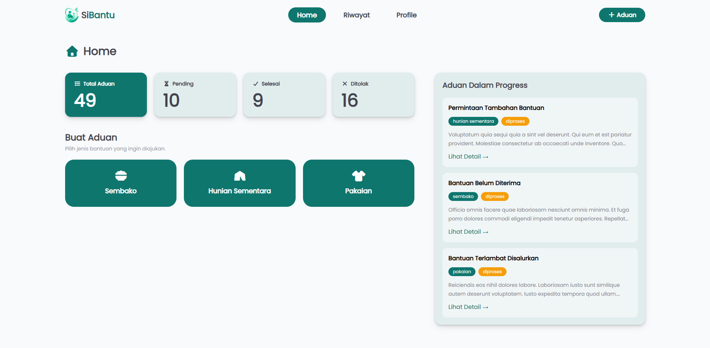

# SiBantu

<p align="center">
  
  
  
  
  
</p>

<p align="center">
  <strong>Sistem Informasi Pengaduan Masyarakat untuk Penyaluran Bantuan Bencana Berbasis Web</strong>
</p>

---

## 📖 Tentang Proyek

**SiBantu** adalah aplikasi berbasis web yang dirancang untuk membantu masyarakat melaporkan kebutuhan bantuan pascabencana secara cepat dan terstruktur.

Melalui sistem ini, masyarakat dapat mengirimkan aduan, melampirkan bukti, menentukan lokasi kejadian melalui peta interaktif, serta memantau status penanganan aduan secara real-time.

Sistem juga menyediakan dashboard khusus untuk Admin dan Manager guna mempermudah proses pengelolaan data serta pembuatan laporan.

---

## ✨ Fitur Utama

### 👥 Masyarakat

* Registrasi dan Login menggunakan NIK
* Mengirim Aduan Bantuan
* Upload Bukti Pendukung
* Penentuan Lokasi dengan Peta Interaktif
* Riwayat Aduan
* Feedback Setelah Aduan Selesai

### 🛠️ Admin

* Kelola Data Pengguna
* Verifikasi Aduan
* Ubah Status Aduan
* Dashboard Statistik
* Generate Laporan PDF

### 📊 Manager

* Monitoring Data Aduan
* Download Laporan PDF
* Rekapitulasi Pengaduan

---

## 🖼️ Tampilan Sistem

### Halaman Login



### Dashboard Admin



### Dashboard Masyarakat



---

## 🏗️ Arsitektur Sistem

```text
Masyarakat
     │
     ▼
  Pengaduan
     │
     ▼
    Admin
     │
     ▼
  Verifikasi
     │
     ▼
 Manager
     │
     ▼
  Laporan PDF
```

---

## 🧰 Teknologi

| Teknologi     | Kegunaan            |
| ------------- | ------------------- |
| Laravel 12    | Backend Framework   |
| PHP 8.3       | Bahasa Pemrograman  |
| MySQL         | Database            |
| Tailwind CSS  | UI Framework        |
| Alpine.js     | Interaktivitas      |
| Leaflet.js    | Peta Interaktif     |
| OpenStreetMap | Sumber Peta         |
| Chart.js      | Statistik Dashboard |
| DomPDF        | Export PDF          |
| Vite          | Asset Bundler       |

---

## 🚀 Instalasi

### Clone Repository

```bash
git clone https://github.com/USERNAME/sibantu.git
cd sibantu
```

### Install Dependency

```bash
composer install
npm install
```

### Setup Environment

```bash
cp .env.example .env
php artisan key:generate
```

### Setup Database

Sesuaikan file `.env`

```env
DB_DATABASE=sibantu
DB_USERNAME=root
DB_PASSWORD=
```

### Jalankan Migrasi dan Seeder

```bash
php artisan migrate --seed
```

### Build Asset

```bash
npm run build
```

atau

```bash
npm run dev
```

### Menjalankan Server

```bash
php artisan serve
```

---

## 🔑 Akun Demo

| Role       | NIK   | Password |
| ---------- | ----- | -------- |
| Admin      | 123   | password |
| Manager    | 1234  | password |
| Masyarakat | 12345 | password |

---

## 📂 Struktur Status Aduan

```text
Pending
   │
   ▼
Diproses
   │
   ▼
Selesai

atau

Pending
   │
   ▼
Ditolak
```

## 📜 Lisensi

Proyek ini dikembangkan untuk keperluan akademik dan pembelajaran.
